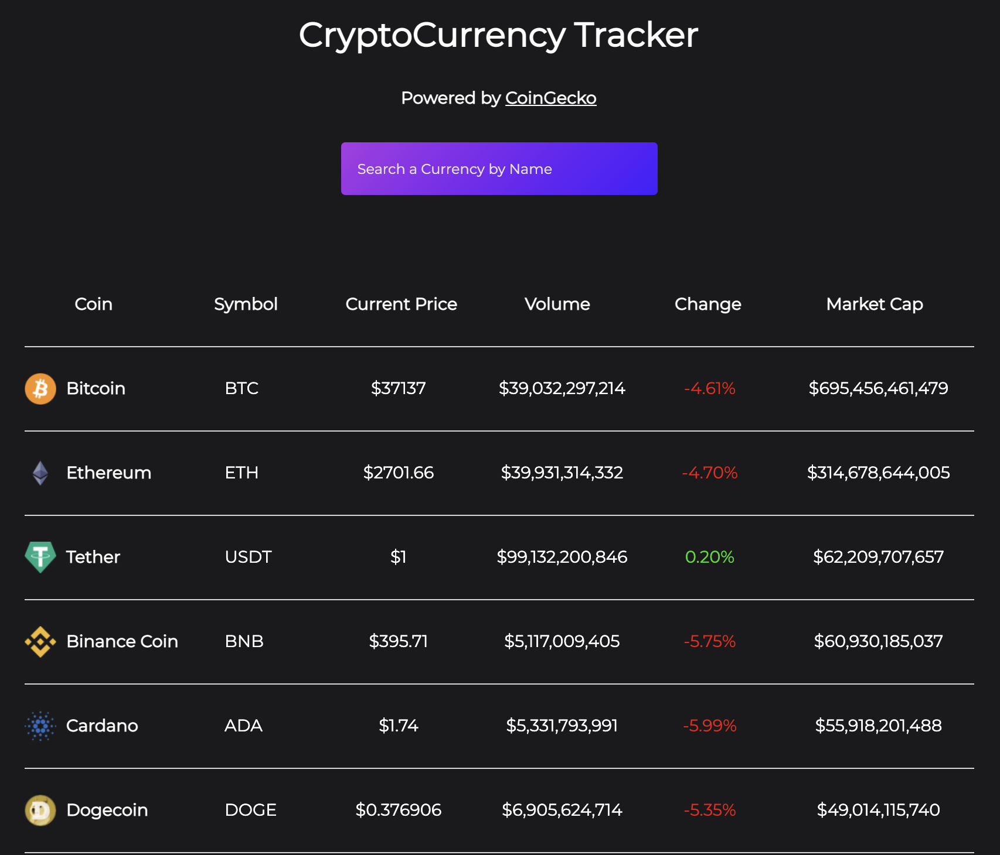

# CryptoCurrency Tracker

This CryptoCurrency Tracker was created using React with Hooks, and uses Axios to access the CoinGecko API.

## Deployed on Heroku
[Launch Here](https://mp-crypto-tracker-react.herokuapp.com/)

## About

I used a [tutorial by 'Brian Design'](https://www.youtube.com/watch?v=9ohK7CapmIs) to help build this app as an exercise to gain more experience using Hooks and to get familiar with the CoinGecko API.

## CoinGecko API

CoinGecko has a very straight forward, free API that provides comprehensive and reliable cryptocurrency market data.

More information about the CoinGecko API can be found [here](https://www.coingecko.com/en/api#explore-api).